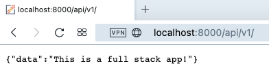

# MycelFlow Backend

## Description

This is the backend API for MycelFlow, a modern event project management platform. It provides RESTful endpoints for user authentication, project and step management, and file uploads. The backend is built with Node.js, Express, and MongoDB, supporting features like project deadlines, step tracking, and user authentication.

## Demo (Screenshots)

- Visual Studio Code running backend:  
  
- API running in browser:  
  

## Technology Used

- **Node.js** (JavaScript runtime)
- **Express.js** (Web framework)
- **MongoDB** (Database)
- **Mongoose** (ODM for MongoDB)
- **JWT** (Authentication)
- **Multer** (File uploads)
- **dotenv** (Environment variables)
- **CORS**, **Morgan**, **Cookie-Parser** (Middleware)

## API Routes

### Auth Routes

- `POST /api/v1/auth`  
  Register a new user

- `POST /api/v1/auth/loginUser`  
  Login existing user

- `POST /api/v1/auth/check-email`  
  Check if email exists

### Project Routes

- `GET /api/v1/projects`  
  Get all projects for authenticated user

- `GET /api/v1/projects/:id`  
  Get a single project by ID

- `POST /api/v1/projects`  
  Create a new project (supports image upload)

- `PUT /api/v1/projects/:id`  
  Update a project

- `DELETE /api/v1/projects/:id`  
  Delete a project

- `POST /api/v1/projects/:id/image`  
  Upload/update project image

### Step Routes

- `POST /api/v1/projects/:projectId/steps`  
  Add a step to a project

## Database Schema

### Project

- `title`: String, required
- `description`: String
- `userId`: ObjectId (ref: User)
- `status`: String (`Not started`, `In Progress`, `Completed`, `Overdue`)
- `dueDate`: Date, required
- `image`: String (file path)
- `steps`: Array of Step subdocuments

### Step (Subdocument)

- `id`: Number, required
- `title`: String, required
- `description`: String
- `completed`: Boolean
- `dueDate`: Date
- `subtasks`: Array of Subtask subdocuments

### Subtask (Subdocument)

- `id`: Number, required
- `title`: String, required
- `done`: Boolean

## Setup Instructions

1. **Clone the repository**

   ```sh
   git clone git@github.com:Code-the-Dream-School/jj-practicum-team-5-back.git
   cd jj-practicum-team-5-back
   ```

2. **Install dependencies**

   ```sh
   npm install
   ```

3. **Configure environment**

   - Create a `.env` file:
     ```
     MONGO_URI=mongodb://localhost:27017/mycelflow
     JWT_SECRET=your_jwt_secret
     ```

4. **Run the development server**

   ```sh
   npm run dev
   ```

5. **Test the API**
   - Visit [http://localhost:8000/api/v1/](http://localhost:8000/api/v1/) in your browser.

---

For more details, see [documentation/mongoose_schema_standards.md](../documentation/mongoose_schema_standards.md) and the [README.md](../README.md) in this repo.
